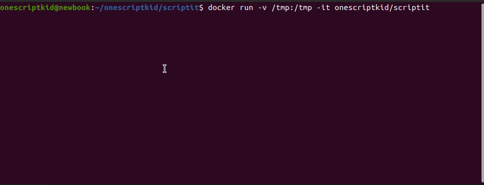

-blue)


# Scriptit

Cookie-cutter for autogenerating bash scripts. Writes the boilerplate so *scripters* can focus on the meat and potatos.



**The template includes ...**
- [unofficial bash strict mode](http://redsymbol.net/articles/unofficial-bash-strict-mode/)
- script dir env var
- git env var
- colored output
- arg parsing
- etc

## 🚀 Getting Started

Follow the series of prompts after cloning and calling `script.sh`. 

### 🐳 Default script - from docker

```shell
docker run -v /tmp:/tmp -it onescriptkid/scriptit --
...
Created script:

        /tmp/scriptit-XXXXoGjHjL/scriptit_script.sh
```
### 🐳 Barebones script - from docker
```shell
docker run -v /tmp:/tmp -it onescriptkid/scripit -s
...
Created script:

        /tmp/scriptit-XXXXoGjHjL/scriptit_script.sh
```
### 💥 Barebones script - from source

```
git clone git@github.com:onescriptkid/scriptit && pushd scriptit > /dev/null
scriptit -s -a0 barebones.sh
```

### 💥 Default script - from source

```shell
git clone git@github.com:onescriptkid/scriptit && pushd scriptit > /dev/null
./scriptit.sh -s script_that_requires_argparsing.sh
...
Created script:

        ~/onescriptkid/scriptit/script_that_requires_argparsing.sh
```
### Barebones script - from source

```
git clone git@github.com:onescriptkid/scriptit && pushd scriptit > /dev/null
scriptit -s barebones.sh
```

## 🌲 Dependencies
 - Bash `5.0.17(1)`
 - Perl `v5.30.0`
 - Ubuntu `20.04`
 - mawk `1.3.4 20200120`
 - sed `(GNU sed) 4.7`

## ⚙️ For devs,
### To test locally,

`test_*` prefix unit tests. To test, run 

*Example unit test for SCRIPT_DIR*
```
./test/test_bash_script_dir.sh

...
test_absolute /tmp/scripit-XXX/script.sh
REALPATH   is: /tmp/scriptit-NS1SFLpaz7
SCRIPT_DIR is: /tmp/scriptit-NS1SFLpaz7

test_symlink_relative
REALPATH   is: /tmp/scriptit-NS1SFLpaz7
SCRIPT_DIR is: /tmp/scriptit-NS1SFLpaz7

test_space_in_pathname /abc/d ef/hi/script.sh
REALPATH   is: /tmp/scriptit-NS1SFLpaz7/abc/d ef/hij
SCRIPT_DIR is: /tmp/scriptit-NS1SFLpaz7/abc/d ef/hij

```

## For Mainteners,
### To build the docker image

`./deploy/build.sh` adds the repo contents to the Dockerfile and adds tags.

```
./deploy/build.sh
...
Step 12/12 : CMD [ /scriptit/scriptit.sh ]
 ---> Running in 145cfe78d5c4
Removing intermediate container 145cfe78d5c4
 ---> 6f7d5a86a88e
Successfully built 6f7d5a86a88e
Successfully tagged scriptit:latest
```

### To push a new docker image to dockerhub,

Login with `docker login -u onescriptkid`

`./deploy/push` pushes the `scriptit` dockerimage to dockerhub

```
./deploy/push.sh
```