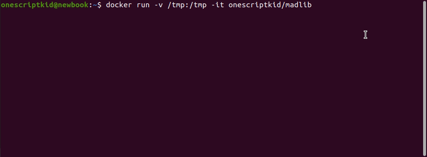

[-blue)](https://www.gnu.org/software/bash/)
[](https://releases.ubuntu.com/20.04/)
[](https://github.com/tests-always-included/mo)

# Madlib

Cookie-cutter for autogenerating bash scripts. Populates the boilerplate so *scripters* can focus on the substance.



**The template includes ...**
- [unofficial bash strict mode](http://redsymbol.net/articles/unofficial-bash-strict-mode/)
- [SCRIPT_DIR](https://stackoverflow.com/questions/59895/how-do-i-get-the-directory-where-a-bash-script-is-located-from-within-the-script) environment variable
- [git](https://stackoverflow.com/questions/949314/how-do-i-get-the-hash-for-the-current-commit-in-git) environment variables
- colored output - <span style="color:red">fail</span> / <span style="color:green">success</span>
- parsing arguments
- parsing yaml
- *and more ...*

## 🚀 Getting Started

Follow the series of prompts after cloning and calling `script.sh`. 

### 💥 Barebones script - from source

```
git clone git@github.com:onescriptkid/madlib && pushd madlib > /dev/null
./madlib.sh -s -a0 barebones.sh
...
Created script:

        ~/onescriptkid/madlib/barebones.sh
```

### 💥 Script with prompts - from source

```shell
git clone git@github.com:onescriptkid/madlib && pushd madlib > /dev/null
./madlib.sh -s script_that_requires_argparsing.sh
...
Created script:

        ~/onescriptkid/madlib/script_that_requires_argparsing.sh
```
### 🐳 Barebones script - from docker
```shell
docker run -v /tmp:/tmp -it onescriptkid/madlib -s -a0
...
Created script:

        /tmp/madlib-XXXXoGjHjL/madlib_script.sh
```
### 🐳 Script with prompts - from docker

```shell
docker run -v /tmp:/tmp -it onescriptkid/madlib
...
Created script:

        /tmp/madlib-XXXXoGjHjL/madlib_script.sh
```

### 🇸🇴 See it live! 

Download example [output](https://raw.githubusercontent.com/onescriptkid/madlib/master/examples/example.sh) via curl
```
curl https://raw.githubusercontent.com/onescriptkid/madlib/master/examples/example.sh > /tmp/example.sh && chmod +x /tmp/example.sh
```

## 🌲 Dependencies

Older versions of **Bash 4.X / 3.X** should work, but are untested

 - Bash `5.0.17(1)`
 - Ubuntu `20.04`
 - *Yaml Parser requires*
   - sed `(GNU sed) 4.7`
   - mawk `1.3.4 20200120`

If missing, install with
```
sudo apt update && sudo apt install bash sed mawk -y
```

## ⚙️ For devs,
### To test locally,

`test_*` prefix unit tests. To test, run 

*Example unit test for SCRIPT_DIR*
```
./test/test_bash_script_dir.sh

...
test_absolute /tmp/madlib-XXX/script.sh
REALPATH   is: /tmp/madlib-NS1SFLpaz7
SCRIPT_DIR is: /tmp/madlib-NS1SFLpaz7

test_symlink_relative
REALPATH   is: /tmp/madlib-NS1SFLpaz7
SCRIPT_DIR is: /tmp/madlib-NS1SFLpaz7

test_space_in_pathname /abc/d ef/hi/script.sh
REALPATH   is: /tmp/madlib-NS1SFLpaz7/abc/d ef/hij
SCRIPT_DIR is: /tmp/madlib-NS1SFLpaz7/abc/d ef/hij

```

## 😇 For Maintainers,

### To cut a new version,

List the top tag `vX.X.X`

```
git describe --tags --abbrev=0 --match "v[0-9]*"
```

Push a new tag `vX.X.X+1`
```
git tag -a "v1.0.2" -m "Release v1.0.2"
git push --tags
```
### To build the docker image

`./deploy/build.sh` adds the repo contents to the Dockerfile and adds tags.

```
./deploy/build.sh
...
Step 12/12 : CMD [ /madlib/madlib.sh ]
 ---> Running in 145cfe78d5c4
Removing intermediate container 145cfe78d5c4
 ---> 6f7d5a86a88e
Successfully built 6f7d5a86a88e
Successfully tagged madlib:latest
```

### To push a new docker image to dockerhub,

Login with `docker login -u onescriptkid`

`./deploy/push` pushes the `madlib` dockerimage to dockerhub

```
./deploy/push.sh
...
dc62e246cb08: Layer already exists 
a8df7183ce0b: Layer already exists 
1ad27bdd166b: Layer already exists 
v0.0.1-1-g557e9e0: digest: sha256:aa52c11054c87c939a24e5d62e974dfa4551ad4ed5d898fd4a19b5d8ee7d4ade size: 2401
```

### Fix git issues
```
eval "$(ssh-agent -s)"
ssh-add ~/.ssh/id_ed25519_onescriptkid
```